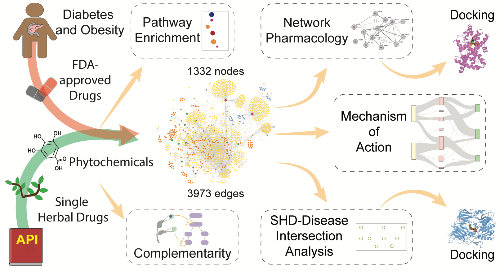

# SHDKG-DiabetesObesity

## To visualize the interactive knowledge graph click below

This repository is associated with the manuscript:  
Priyotosh Sil#, Rahul Tiwari#, Vasavi Garisetti, Shanmuga Priya Baskaran, Fenita Hephzibah Dhanaseelan, Smita Srivastava, and Areejit Samal*, [<i> Computational investigation of single herbal drugs for diabetes and obesity using knowledge graph and network pharmacology </i>](https://doi.org/10.48550/arXiv.2601.21643), arXiv 2601.21643 (2026).  
(* Corresponding authors)
 

## Contributor
- Priyotosh Sil, Rahul Tiwari, and Vasavi Garisetti

